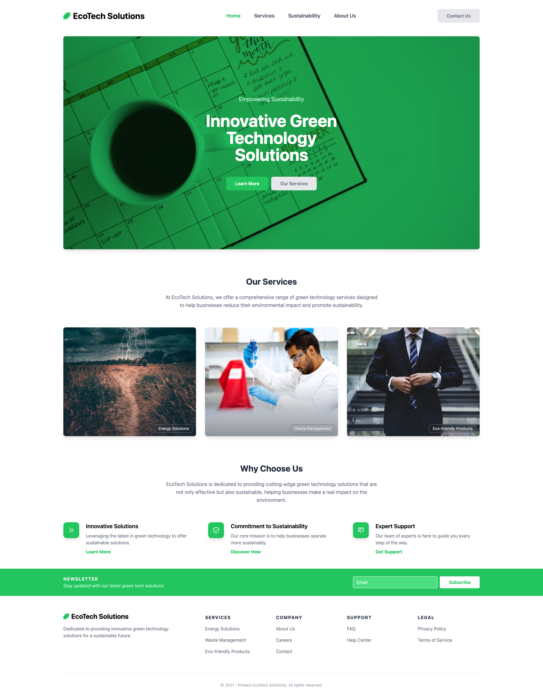

# ocean-tech-school-mentoria-framework-css
Projeto da Mentoria do Programa Ocean Tech School do Samsung Ocean, falando sobre Frameworks de CSS para Web.

## Branches

- Main: site final de exemplo
- Bootstrap: Exemplo com elemento simples
- Tailwind: Exemplo com elemento simples
- Flowrift: Construção de página com seções

## Exemplo de site final

